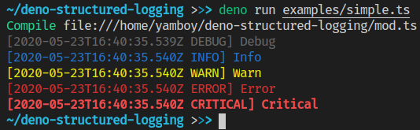
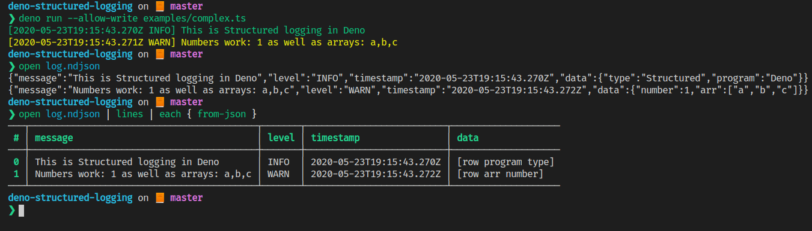

# Deno Structured Logging (currently unstable)

[](https://doc.deno.land/https/raw.githubusercontent.com/Yamboy1/deno-structured-logging/master/mod.ts)
[](https://deno.land/x/deno_structured_logging@0.4.1)

A better logger for deno, with support for structured logging.

## Simple Example
```ts
import { createLogger, consoleSink } from "https://deno.land/x/deno_structured_logging@0.4.1/mod.ts";

const logger = createLogger().addSink(consoleSink());

logger.debug("Debug");
logger.info("Info");
logger.warn("Warn");
logger.error("Error");
logger.critical("Critical");
```


## More complex example
```ts
import { green } from "https://deno.land/std@0.51.0/fmt/colors.ts";
import {
  createLogger,
  LogLevel,
  consoleSink,
  fileSink,
  jsonFormat,
  textFormat,
} from "https://deno.land/x/deno_structured_logging@0.4.1/mod.ts";

const logger = createLogger({
  minimumLevel: LogLevel.INFO,
  outputFormat: textFormat, // You can customise the default output format
})
  .addSink(consoleSink({
    colorOptions: { info: green } // You can customise the log level colors
  }))
  .addSink(fileSink("log.ndjson"), jsonFormat); // You can set a custom format per sink

logger.debug("Debug"); // Ignored due to the minimumLevel
logger.info("This is {type} logging in {program}", "Structured", "Deno");

// It doesn't matter what these variables are called,
const num = 1;
const array = ["a", "b", "c"];

logger.warn("Numbers work: {number} as well as arrays: {arr}", num, array);
```


## String formatting

DSL uses it's own form of string formatting, similar to Serilog in C#. The syntax for this is 
```ts
logger.info("Hello {name}, this is another {variable}", "First", 2);
```
where `"First"` and `2` are substituted into `{name}` and `{variable}` respectively. With the default console sink, the names don't really matter however they help readability of the format and with more complex formats, for example a JSON format, they could be used as property names.

## Available sinks

A sink is an output for DSL. For example the console sink prints to the console, or the file sink writes to a file. At this point a sink is literally just a function, so it's easy enough to create your own.

Available sinks:

- Console Sink (with colors)
- File Sink
- More coming soon